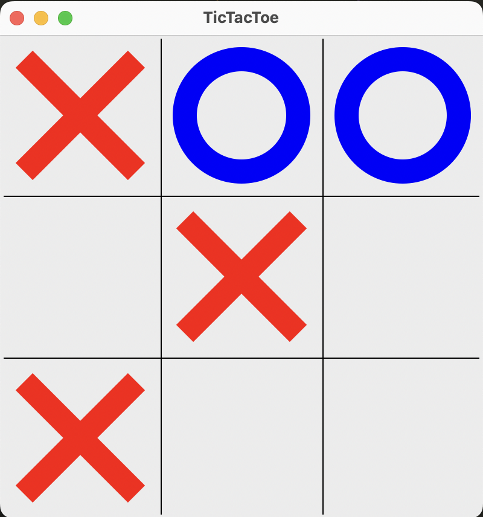
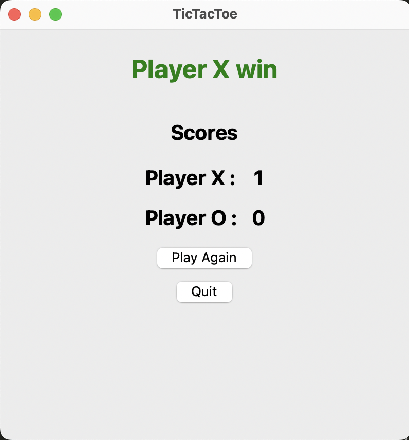

# TicTacToe

### Description
This is a interactive multiplayer TicTacToe Game made using Python and GUI library Tkinter.

### ScreenShots



### Game Control
1. Player X starts the game
2. Click on the grid to mark your symbol
3. Score pannel is shown after game is over
4. Players can restart the game or quit the game

### Running locally
```
git clone git@github.com:gurung69/TicTacToe.git
python tictactoe.py
```